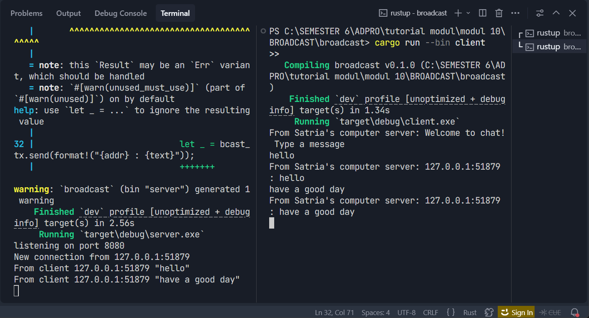

# Modul-10-Asynchronous-Programming-broadcast

## Original code of broadcast chat

Untuk menguji proyek ini, langkah pertama yang dilakukan adalah mengaktifkan server melalui perintah cargo run --bin server, yang berjalan pada alamat 127.0.0.1:2000. Setelah server aktif, tiga terminal baru dibuka untuk menjalankan tiga instansi klien secara terpisah menggunakan perintah cargo run --bin client. Begitu terhubung, setiap klien langsung disambut dengan pesan selamat datang dan siap digunakan untuk mengetik teks.

Ketika salah satu klien mengirimkan pesan, server akan mencatat alamat IP pengirim beserta isinya, lalu meneruskan (broadcast) pesan tersebut ke seluruh klien yang sedang aktif, termasuk si pengirim asli. Seperti yang terlihat pada tangkapan layar, saat teks seperti "Hello" diketik di salah satu terminal klien, pesan tersebut langsung terdistribusi ke seluruh layar klien lain dengan format From server: Hello.

Kemampuan distribusi pesan secara massal ini berpusat pada penggunaan Tokio broadcast channel, yang memfasilitasi server untuk membagikan setiap data masuk ke semua koneksi klien sekaligus. Selain itu, makro tokio::select! diimplementasikan baik pada sisi server maupun klien guna mengelola proses kirim dan terima pesan secara simultan (concurrent). Secara keseluruhan, eksperimen ini berhasil mendemonstrasikan pemanfaatan fitur asinkronus Rust dan komunikasi berbasis channel untuk membangun arsitektur obrolan terdistribusi yang

## Modifying the websocket port

Pada skenario kali ini, konfigurasi port untuk server dan klien telah disamakan, yaitu menggunakan port 8080. Berdasarkan tangkapan layar yang dilampirkan, server berhasil aktif dan mendengarkan koneksi pada port tersebut, sementara pihak klien dapat langsung terhubung tanpa kendala. Begitu koneksi terjalin, klien segera menerima pesan sambutan yang dikirimkan oleh server.

Interaksi yang berjalan mulus ini membuktikan bahwa komunikasi berbasis WebSocket hanya dapat berfungsi secara valid jika alamat host dan nomor port pada kedua sisi benar-benar selaras. Hal ini kontras dengan pengujian sebelumnya yang menggunakan port berbeda—di mana klien mencoba mengakses port 8080 padahal server berada di port 2000 sehingga koneksi gagal. Dengan menyamakan port, proses TCP handshake dapat berjalan sukses, yang kemudian memungkinkan protokol WebSocket untuk melakukan negosiasi (handshake WebSocket) dan membuka jalur komunikasi dua arah (two-way communication channel) secara penuh.

## Small changes. Add some information to client

Pada tahap eksperimen ini, pembaruan dilakukan pada sisi klien dengan memodifikasi format visual pesan menjadi "From Satria's computer server: ...". Perubahan tampilan ini diterapkan langsung di dalam file client.rs pada bagian yang menangani pencetakan pesan masuk.

Sementara itu, pada sisi server (server.rs), ditambahkan baris kode bcast_tx.send(format!("{addr} : {text}"))?; untuk memastikan setiap pesan yang masuk dikemas bersama alamat IP dan nomor port pengirim sebelum disebarluaskan (broadcast). Melalui kombinasi kedua perubahan ini, setiap klien kini dapat mengidentifikasi pengirim pesan secara transparan, lengkap dengan teks prefiks yang mudah dibaca serta detail teknis koneksi sebagai pengenal unik.